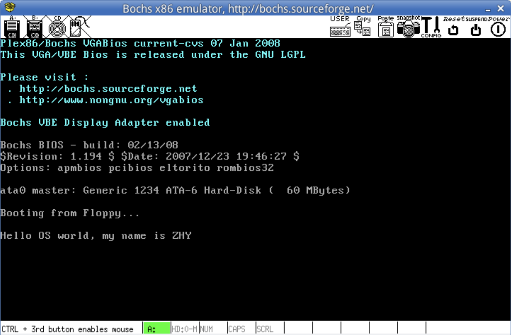

# ZHY-OS
This is a newcomer operating system which is named by my personal Chinese name and motivated based on Linux 0.11 OS

> ZHY-OS is my self-made operating system which is based on Linux 0.11 (a simple implement of Linux system) . According to it, it's a very great way to learn basic knowledges of OS not limited to figure out the definatioin of operating system. 

## 目录

- [上手指南](#上手指南)
  - [开发前的配置要求](#开发前的配置要求)
- [贡献者](#贡献者)
  - [如何参与开源项目](#如何参与开源项目)
- [版本控制](#版本控制)
- [作者](#作者)
- [鸣谢](#鸣谢)

### 上手指南

参照[https://zhychestercheung.github.io](https://zhychestercheung.github.io)中关于Operating system的相关知识详解，先对整体OS的内容和知识框架有大体的了解。

##### 开发前的配置要求

1. VMware下的 Ubuntu 14.04 或实验楼已经配置好的集成环境
2. hit-oslab-linux-20110823.tar.gz
3. 采用bochs模拟器加载Linux 0.11的Image文件

### 贡献者

请阅读**CONTRIBUTING.md** 查阅为该项目做出贡献的开发者。

#### 如何参与开源项目

贡献使开源社区成为一个学习、激励和创造的绝佳场所。你所作的任何贡献都是**非常感谢**的。

1. Fork the Project
2. Create your Feature Branch (`git checkout -b feature/AmazingFeature`)
3. Commit your Changes (`git commit -m 'Add some AmazingFeature'`)
4. Push to the Branch (`git push origin feature/AmazingFeature`)
5. Open a Pull Request

### 版本控制

该项目使用Git进行版本管理。您可以在repository参看当前可用版本。

### 作者

张瀚元@zhyChesterCheung

知乎:Chester  &ensp; qq:2640617395

 *您也可以在贡献者名单中参看所有参与该项目的开发者。*

### 版权说明

该项目签署了MIT 授权许可，详情请参阅 [LICENSE.txt](https://github.com/shaojintian/Best_README_template/blob/master/LICENSE.txt)

### 鸣谢

- [GitHub Emoji Cheat Sheet](https://www.webpagefx.com/tools/emoji-cheat-sheet)
- [Img Shields](https://shields.io)
- [Choose an Open Source License](https://choosealicense.com)
- [GitHub Pages](https://pages.github.com)
- [Animate.css](https://daneden.github.io/animate.css)
- [xxxxxxxxxxxxxx](https://connoratherton.com/loaders)
